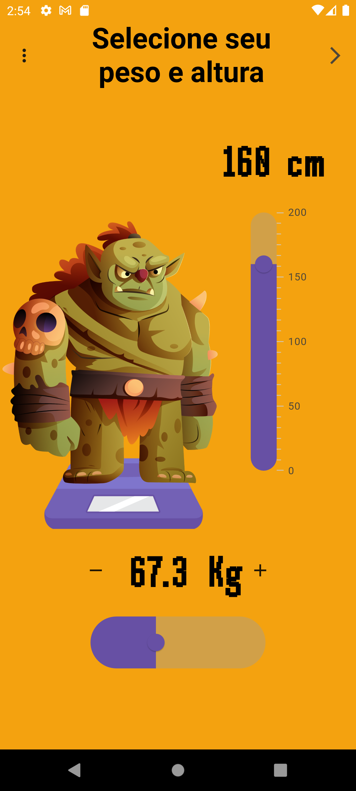

# 🏋️ BMI Calculator
## Sobre o projeto

 O aplicativo calcula o Índice de Massa Corporal (IMC) com base nas informações de peso e altura fornecidas pelo usuário e armazena os dados utilizando o Hive.

## Screenshots

### Tecnologias utilizadas

* Flutter
* Provider
* Hive
* Testes

### Desenvolvedora

Jusy Lopes
https://www.linkedin.com/in/jusylopes
